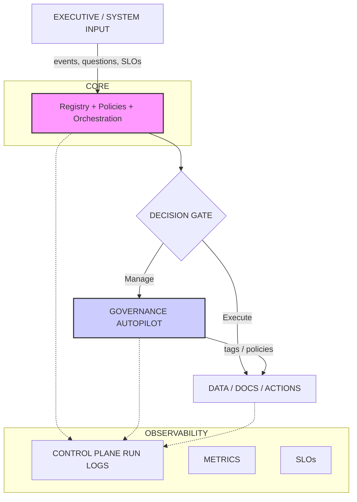

# 🏢 Enterprise AI Control Plane (V1)

**A Snowflake-native orchestration layer that unifies agents, models, governance, observability, and decision systems into a single coordinated AI operating layer.**

---

This Control Plane acts as the **brain** of your enterprise AI ecosystem — orchestrating **Atlas (MLOps)**, the **Snowflake Intelligence Agent (reasoning & action)**, and **Governance Autopilot (PII detection, policies, tagging)**.

Designed as both a **reference architecture** and a **production-ready foundation** for enterprise AI systems.

---

## 🔥 What This Control Plane Does

The Enterprise AI Control Plane provides four critical pillars:

### ✅ 1. Registry
Central definition of:
* Agents
* Workflows
* Policies

### ✅ 2. Policy Engine
Determines:
* What is **allowed** to happen
* Which **thresholds or rules** trigger actions
* How **governance requirements** influence workflows

### ✅ 3. Workflow Engine
Orchestrates complex, cross-system actions:
* `drift > threshold` → evaluate policy → retrain → summarize → log
* `detect sensitive docs` → update tags → restrict access → log
* `supply chain anomaly` → correlate structured + unstructured data → notify

### ✅ 4. Observability Layer
Captures every relevant signal:
* Run logs
* Decisions
* Agent reasoning
* SLO status
* Errors

---

## 🎯 Framework-Light by Design

The Control Plane plugs directly into your existing projects:

| Component | Repo |
| :--- | :--- |
| **Atlas MLOps Platform** | `atlas-mlops-snowflake` |
| **Snowflake Intelligence Agent V2** | `snowflake-intelligence-agent-v2` |
| **Governance Autopilot** | `ai-governance-autopilot-snowflake` |

---

## 🧠 High-Level Architecture



---

## 📁 Project Layout

```text
enterprise-ai-control-plane/
│
├── src/control_plane/
│   ├── config.py          # Global configuration, environment flags
│   ├── registry.py        # Agent + workflow registry (in-memory or DB-backed)
│   ├── policies.py        # Create & evaluate enterprise policies
│   ├── workflows.py       # Core orchestration logic
│   ├── agents.py          # Interfaces to Atlas, Intelligence Agent, etc.
│   └── observability.py   # Run logs, metrics, and SLOs
│
├── sql/
│   ├── create_schemas.sql
│   ├── run_log_tables.sql
│   └── example_policies.sql
│
├── notebooks/
│   └── drift_demo.ipynb   # Complete end-to-end drift management example
│
├── LICENSE
└── README.md
```

---

## 🛠 How to Use This Control Plane

### 1. Register agents & workflows

```python
from control_plane.registry import register_agent, register_workflow

register_agent("atlas", config={...})
register_agent("intelligence_agent", config={...})

register_workflow("fraud_drift_management")
```

### 2. Add a policy

```python
from control_plane.policies import add_policy

add_policy("fraud_max_drift", {"max_drift": 0.15})
```

### 3. Run a workflow

```python
from control_plane.workflows import run_workflow

run_workflow("fraud_drift_management", drift=0.22)
```

### 4. Inspect run logs

```sql
SELECT * FROM CONTROL_PLANE.RUN_LOG ORDER BY timestamp DESC;
```

---

## 🎯 Design Goals

1.  **Snowflake-Native First:** Designed to run where your models, data, and governance already live.
2.  **Composable:** Atlas, Intelligence Agent, and Governance Autopilot stay independent — the Control Plane orchestrates across them.
3.  **Auditable:** Every action is logged for compliance, forensics, or business reviews.
4.  **Readable:** The repo is both a working baseline implementation and an interview-ready architecture reference.

---

## 🔧 Example: Fraud Drift Management Workflow

**Scenario:** When `drift > threshold`:

1.  Atlas retraining triggers.
2.  Intelligence Agent generates an executive summary.
3.  Observability layer logs every action, input, and decision.

**Example Output:**

```text
=== Fraud Drift Management Workflow Summary ===
- Drift of 0.22 detected (policy threshold = 0.15)
- Policy evaluation → TRIGGERED
- Atlas retraining pipeline successfully initiated
- Intelligence Agent generated human-readable summary
- All actions logged in RUN_LOG for full auditability
```

---

## 📜 License

MIT License — see `LICENSE` for details.

---

## ⭐ If You Find This Useful

* ⭐ Star the repo
* 🧱 Use it as a template for your enterprise control plane
* 📰 **[Data Drift Newsletter](https://www.linkedin.com/newsletters/7251946577877991425/)**
* 🔗 **[LinkedIn](https://www.linkedin.com/in/mattreinsch)**
* 🌐 **[Website](https://mattreinsch.com)**
* ✍️ **[Medium](https://medium.com/@mattsreinsch)**
